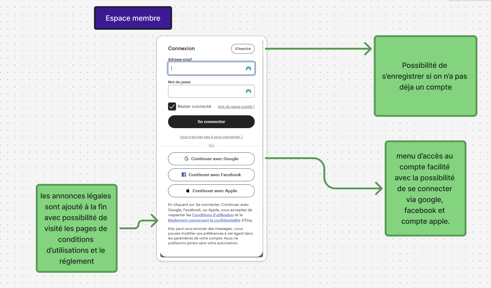

# Analyse de devis

Membres de l'équipe : Khoudou Mohamed, El Kouarir Meriem, Souiba Loubna et Breau Camille

### Compréhension du mandat

Lord Reginald Stampee souhaite la création d’une plateforme numérique d’enchères de timbres, accessible mondialement, intuitive, élégante et adaptée aux besoins des philatélistes.
Mission: Création d'une plateforme d'enchères de timbres en ligne pour Lord Reginald Stampee.
Vision: Transformer une activité traditionnelle de philatélie en expérience numérique internationale.
Portée: Interface publique (phase 1). Interface d'administration à développer ultérieurement.

### Étude de la concurrence

Afin de mieux comprendre le marché, les attentes des utilisateurs et les bonnes pratiques en matière d'expérience utilisateur, nous avons réalisé une étude concurrentielle en analysant quatre sites : deux plateformes d’enchères, un site spécialisé dans la vente de timbres et une plateforme généraliste d’achat en ligne.

#### Delcampe

##### Site :

https://www.delcampe.net/fr/collections/

##### Description :

Delcampe.net est une plateforme de commerce électronique spécialisée dans les objets de collection. Le site se distingue par son focus sur la philatélie, la numismatique, la cartophilie et d'autres domaines de collection, attirant une communauté internationale de passionnés. Contrairement aux sites d'enchères généralistes, Delcampe offre des fonctionnalités spécifiquement conçues pour les collectionneurs, comme des filtres de recherche avancés, un système d'alerte pour les pièces recherchées et des forums spécialisés.

##### Analyse :

##### Conclusion :

Delcampe offre une plateforme riche en contenu et fonctionnalités pour les collectionneurs, avec une solide organisation par catégories et des filtres avancés. Cependant, le site souffre de contrastes insuffisants et d'une navigation complexe qui constituent des obstacles à une expérience utilisateur optimale.

 

#### Etsy

##### Site :

https://www.etsy.com/ca-fr/

##### Description :

Etsy est une plateforme de commerce en ligne spécialisée dans la vente de produits faits main, vintage et de fournitures créatives. Elle met en relation des créateurs indépendants et des acheteurs du monde entier, en offrant des articles uniques dans des catégories variées comme les bijoux, la décoration, les vêtements et l’art. Le site fonctionne comme une marketplace, où chaque vendeur gère sa propre boutique et ses conditions de vente.

##### Analyse :

##### Conclusion :

Le site Etsy propose une expérience utilisateur intuitive, visuelle et rassurante. La navigation est fluide, les informations sont bien hiérarchisées et les visuels de qualité facilitent l’achat. Les avis clients renforcent la confiance.
Cependant, certaines zones pourraient être allégées et l’accessibilité renforcée, notamment au niveau des contrastes et de la navigation clavier.

 

#### Million

##### Site:

https://www.millon.com/nos-services

##### Description :

​Le site millon.com est la plateforme officielle de la Maison Millon, une maison de ventes aux enchères fondée en 1928. Elle organise plus de 350 ventes par an dans ses salles de Paris, Milan, Nice, et Bruxelles, couvrant 35 spécialités, notamment les beaux-arts, la bande dessinée, la philatélie, la numismatique, la haute joaillerie, la mode vintage, et les instruments de musique.
Millon propose également des ventes privées à prix fixes, des estimations gratuites en ligne, et des expertises à domicile. Le site offre des guides pratiques pour les acheteurs et les vendeurs, un calendrier des ventes à venir, et des résultats de ventes passées.

##### Analyse :

##### Conclusion :

Le site est visuellement agréable, mais souffre d’un manque d’organisation qui peut submerger l’utilisateur. Bien qu’il propose des fonctionnalités utiles comme la barre de recherche, la FAQ ou la création d’alertes, celles-ci sont mal positionnées et ne respectent pas toujours les normes graphiques. De plus, les menus sont trop grands et manquent de structure.

 

### TM Philatélie

##### Site :

https://www.tmphilatelie.com/timbres-de-collection.html?gad_source=1&gbraid=0AAAAADR-LUsDhvcJ7Om6-0ieTBxiOA9N9&gclid=Cj0KCQjwt8zABhDKARIsAHXuD7bzOKFuVZkZ-KWwkBWmMON2UBVofkKrJe5sK-OcliGkMY_G4lO85qkaAtuJEALw_wcB

##### Description :

TM Philatélie est une boutique en ligne dédiée aux amateurs de timbres et à l’univers de la philatélie. Spécialisée dans la vente de timbres de collection, elle propose un large éventail d’articles philatéliques, allant des pièces classiques aux éditions limitées. Ce site se distingue par son expertise reconnue, son service d’évaluation personnalisé et son accompagnement sur mesure pour les collectionneurs souhaitant enrichir ou vendre leur collection. Grâce à une interface intuitive et des catégories bien organisées, TM Philatélie simplifie la recherche de pièces rares tout en garantissant la qualité des produits et un service client attentif et réactif.

##### Analyse :

  
   
  
  
  
  
  
  
  

##### Conclusion :

Le site TMPhilatélie.com offre un univers visuel sobre et professionnel, adapté aux passionnés de philatélie. Cependant, il présente des limites en matière d’ergonomie et de navigation. Certaines fonctionnalités clés comme le menu sur mobile rencontrent des dysfonctionnements, rendant la navigation difficile sur smartphone. L’organisation des contenus, bien que riche, manque de hiérarchisation claire, ce qui peut désorienter l’utilisateur. Enfin, les éléments interactifs (boutons, liens) n’ont pas toujours un feedback visuel suffisant, affectant l’intuitivité générale de l’expérience.

 

## Fonctionnalités requises :

### 1 - Accessibilité

Prévoir différentes maquettes adaptées aux tailles d’écran (responsive design), notamment pour les formats mobile, tablette et ordinateur.

   

### 2 - Entête: commune à chaque page du site internet

#### 2.1 - Logo de l'entreprise de Lord Reginald Stampee

    Le logo sera cliquable et redirigera directement vers la page d’accueil.

   

#### 2.2 - Navigation en quatre parties

##### 2.2.1 - Bouton "Catégories" à coté du logo

      Au survol, un menu s’ouvre avec 5 catégories, chacune contenant un sous-menu.
      Par type de timbre
      - Timbres-poste
      - Timbres commémoratifs
      - Timbres courants
      - Timbres de poste aérienne
      - Timbres fiscaux
      - Timbres de service
      - Préoblitérés
      - Carnets / Blocs / Feuilles complètes

      Par origine géographique
      - France
      - Europe (hors France)
      - Afrique
      - Amérique
      - Asie
      - Océanie
      - Colonies / Territoires d’outre-mer

      Par période d’émission
      - Avant 1900
      - 1900–1950
      - 1950–2000
      - Après 2000

      Par état du timbre
      - Neuf sans charnière
      - Neuf avec charnière
      - Oblitéré
      - Avec certificat
      - Erreur / Variété

      Par thématique
      - Faune (animaux, oiseaux)
      - Flore (plantes, fleurs)
      - Personnalités historiques
      - Sport
      - Art / Culture
      - Transport (trains, avions, etc.)
      - Fêtes / événements

      Par statut d'enchère
      - À venir
      - En cours
      - Terminé

##### 2.2.2 - Navigation partie membre (en haut à droite)

      Avant authentification :
      - Se connecter
      - Devenir membre
      - Icône langue / pays

      Après authentification :
      - Nom et prénom du membre
      - Icône langue / pays
      - Icône Notifications / messagerie : provenant des autres membres ou de la plateforme.
      - Icône "Suivi de mes mises en cours" :
        - En cliquant dessus,
        un menu déroulant apparaît affichant les enchères suivies,
        accompagnées de pastilles de couleur et du nom de chaque enchère.
          *Code couleur :
          Vert clair : mise la plus haute
          Vert foncé : enchère terminée gagnée
          Orange : votre mise n’est pas la plus élevée
          Rouge : enchère terminée perdue*
        - En cliquant sur une enchère dans le menu,
        le membre est redirigé directement vers la page correspondante de l’enchère.
      -Icône "Mes alertes":
      le membre a la possibilité de créer des alertes sur des timbres spécifiques,
      des pays ou des mots-clés.

##### 2.2.3 - Barre de recherche

    La barre de recherche propose des suggestions
    en fonction de la saisie de l’utilisateur
    et affiche l’historique des dernières recherches.

##### 2.2.4 - Menu situé en dessous de la barre de recherche

    - Calendrier des enchères,
    - Demande d’expertise,
    - Nous contacter,
    - À propos de nous.

   

### 3 - Timbre

#### 3.1 - Page présentation du catalogue

##### 3.1.1 Filtres

    Même catégorie que dans le menu catégorie de l'entête.

##### 3.1.2 Bouton créer une alterte

    Disponible en tout temps et faisable à partir des filtres séléctionnés.

##### 3.1.3 Carte timbre - Présentation courte

    - Image du timbre principal :
      Vue claire et de bonne qualité du timbre.
    - Nom du timbre
    - Détails techniques :
      - Pays d'origine
      - Année d'émission
      - Valeur faciale
      - Type de timbre
      - Condition : Neuf, oblitéré, etc.
      - Statut : disponible aux enchères (lien pour voir l'événement).
      - Si enchère en cours : "Placer une mise".

   

#### 3.2 - Page détaillée du timbre - Accessible en cliquant sur la carte timbre

      - Image du timbre principal :
        Vue claire et de bonne qualité du timbre.
      - Galerie d'images supplémentaires :
        Bouton pour afficher d'autres photos du timbre.
      - Zoom interactif :
        Cliquer sur l’image principale pour zoomer.
      - Nom du timbre
      - Description du timbre :
        Explication courte.
      - Détails techniques :
        - Pays d'origine
        - Année d'émission
        - Valeur faciale
        - Dimensions du timbre
        - Type de timbre
        - Condition : Neuf, oblitéré, etc.
        - Statut :
          disponible aux enchères (lien pour voir l'événement)
        - Si enchère en cours : "Placer une mise"
      - Authentification / Certificat :
        Lien ou image du certificat.
      - Historique de la vente :
        Prix de vente, historique d'enchères.
      - Option "Alerte" :
        Ajouter une alerte sur ce timbre.
      - Commentaires ou notes :
        Laisser des avis ou des évaluations.

   

### 4 - Profil membre

#### 4.1 - Vue par le membre

    - Coordonnées du membre : peut-être modifiables par le membre.
      - Nom et prénom
      - Adresse
      - Adresse courriel
      - Téléphone
      - *Moyen de paiement :
      Carte de crédit ou compte bancaire préenregistré pour garantir le paiement ?*

    - Mandat :
      - *Si le membre fait l'achat pour une personne ou pour une entreprise ?*

    - Mes transactions :
      - Offres en cours et leur état
      - Historique des offres

 

#### 4.2 - Vue par les autres membres (abonnés)

    - Nom et prénom
    - Membre depuis (date d'inscription)
    - Acquisitions
      - Affichage sous forme de carte pour chaque timbre acquis.
    - Timbres proposés aux enchères
      - Chaque timbre est affiché sous forme de carte
        La carte indique la catégorie :
        - À venir (si l’enchère n’a pas encore commencé)
        - Vendue (si le timbre a déjà été vendu)

 

### 5 - Calendrier des enchères

Calendrier des enchères à venir  
 _Les membres doivent-ils s'inscrire à l'événement à l'avance ?_
_Fonctionnalité ajout au calendrier personnel de l'utilisateur?_

 

### 6 - Voir les timbres des proches

Seuls les utilisateurs membres peuvent rechercher une personne via la barre de recherche et envoyer une demande de connexion afin de consulter ses timbres.
Sur la page de profil, la section « Voir mes connexions » répertorie toutes les personnes auxquelles l’utilisateur est abonné ainsi que celles qui sont abonnées à lui.
Il est également possible d’envoyer des messages aux autres membres.

 

## Questions supplémentaires :

- Quelles sont les langues et les outils à notre disposition, ou un simple bouton suffit-il ?
- Quels sont les pays exactement pour la livraison ?
- Est-ce que les utilisateurs doivent voir les prix selon la devise de leur pays ?
- Est-ce que Lord Reginald Stampee souhaite mettre en place un portefeuille électronique pour ses membres ?
- Moyen de paiement : Carte de crédit ou compte bancaire préenregistré pour garantir le paiement ?
- Option de mandat, si le membre fait l'achat pour une personne ou pour une entreprise ?
- Les membres doivent-ils s'inscrire à l'événement à l'avance ?
- Fonctionnalité ajout au calendrier personnel de l'utilisateur ?
